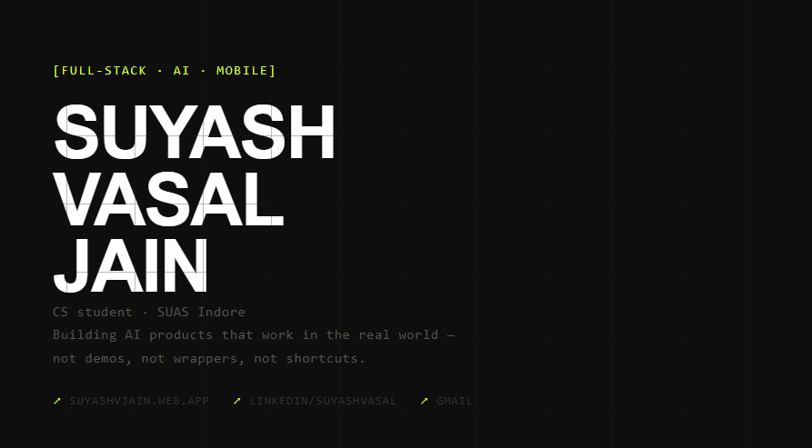

&nbsp;
&nbsp;

---

CS student at SUAS Indore. I'm drawn to the intersection of **AI, product design, and engineering** - building things that are thoughtfully designed and technically honest. No mock data. No fake pipelines. No cutting corners on the parts that actually matter.

Right now I'm deep in **RAG systems, local LLMs, and on-device AI** - not because it's trendy, but because I think the most interesting products are the ones that work where the internet doesn't.

---

## Selected Work

### [Prepwise](https://prepwise-mocha.vercel.app) - AI Mock Interview Platform
> Every prep tool gives you the same recycled question bank. Prepwise doesn't.

Upload your syllabus PDF → Aria (the AI coach) reads it, indexes it with a real RAG pipeline, and interviews you on what you *actually* studied. Not a wrapper. Not a question bank. Real semantic retrieval, real scoring, real weak topic tracking.

`Next.js 16` `FastAPI` `Groq - Llama 3.3 70B` `FAISS` `Supabase` `Vercel + Railway`

**[→ Live demo](https://prepwise-mocha.vercel.app)** &nbsp;·&nbsp; **[→ Source](https://github.com/SuyashVJain/prepwise)**

---

### [NeuralVoid](https://github.com/SuyashVJain/NeuralVoid) - Offline AI Tutor
> Local Gemma 3 + FAISS RAG. No internet. No compromise.

Cross-platform Flutter app that runs a full LLM + RAG pipeline entirely on-device. Built for students in areas with unreliable connectivity - because good tools shouldn't require a good connection.

`Flutter` `Gemma 3` `Ollama` `FAISS` `SentenceTransformers`

---

### [VahanVault](https://github.com/SuyashVJain/vahan_vault) - Vehicle Document Manager
> Everything on-device. Nothing in the cloud.

Offline-first Flutter app with biometric authentication, structured local storage via Drift, and smart expiry reminders. Your documents stay yours.

`Flutter` `Drift` `Biometric Auth` `Offline-first`

---

### [Mission Atlas](https://github.com/yashordK/Mission-Atlas-SIH-) - Travel Safety Platform `SIH 2025 · Internal Winner`
> Swadeshi travel safety - built for Smart India Hackathon 2025.

Blockchain-verified identity, real-time SOS alerts, GPS sharing, and an AI itinerary planner. Internal winner at SIH 2025.

`React Native` `Blockchain` `AI` `Real-time GPS`

---

## Stack

| | |
|---|---|
| **Languages** | TypeScript · JavaScript · Python · Java · C · SQL |
| **Frontend** | React · Next.js · Tailwind CSS |
| **Backend** | Node.js · Express.js · FastAPI |
| **Mobile** | Flutter · React Native |
| **AI / ML** | RAG · FAISS · SentenceTransformers · Ollama · Local LLMs · Groq |
| **Databases** | Supabase · MySQL · SQLite · Firebase |
| **Tools** | Figma · Git · Postman |

---

## Currently

- Building deeper in AI product development - RAG systems, local LLMs, real integrations
- Sharpening full-stack fundamentals across React, TypeScript, and Node.js
- Exploring where **design systems and developer tooling** intersect

---

## Beyond the code

When I'm not building - I'm into **dancing, music, and design**. I spend time experimenting with UI/UX, working on visual interfaces, and occasionally helping with branding or creative direction. The overlap between technology and design is where I feel most at home.

---

*Open to internships, collaborations, and products worth building.*

